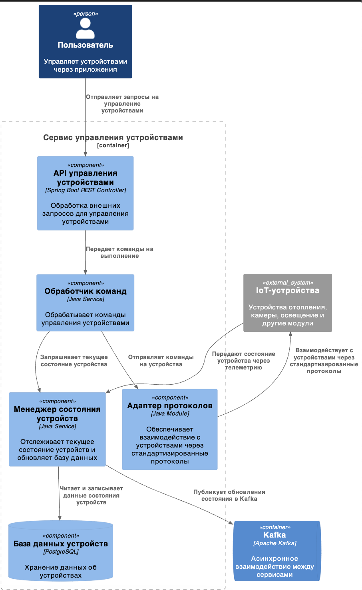

Это шаблон для решения **первой части** проектной работы. Структура этого файла повторяет структуру заданий. Заполняйте его по мере работы над решением.

# Задание 1. Анализ и планирование

Чтобы составить документ с описанием текущей архитектуры приложения, можно часть информации взять из описания компании условия задания. Это нормально.

### 1. Описание функциональности монолитного приложения

**Настройка системы:**
- Прилоежние поддерживает добавление новых систем отопления 
- Приложение может вернуть данные о конкретной системе отопления по id

**Управление отоплением:**

- Пользователь может включить определную систему отопления
- Пользователь может отключить определную систему отопления
- Пользователь может задать желаемую температуру

**Мониторинг температуры:**

- Пользователь может запросить текущую температуру

### 2. Анализ архитектуры монолитного приложения

Перечислите здесь основные особенности текущего приложения: какой язык программирования используется, какая база данных, как организовано взаимодействие между компонентами и так далее.

- Архитектура приложения представляет из себя монолит на Java с СУБД Postgres.
- Приложение построено с использованием фреймворка Spring Boot
- Ключевые слои приложения:
  - Controller — для управления HTTP-запросами (REST API).
  - Service — для реализации бизнес-логики.
  - Repository — для работы с базой данных.
  - Entity — для представления данных в виде объектов Java.
- Всё синхронно. Никаких асинхронных вызовов, микросервисов и реактивного взаимодействия в системе нет.
- В коде предусмотрена обработка ошибок, например, выброс исключения при отсутствии записи в базе данных. (RuntimeException) 
- Пользовательской статистики и аналитики нет.

### 3. Определение доменов и границы контекстов

Домены которые вижу в целевой картине

**1. Управление пользователями**

    Контекст:
        - Сущности: Пользователь, Роль, Сессия, Тариф
        - Сервисы: Регистрация, Авторизация, Оплата

**2. Управление устройствами (IoT-экосистема)**
    
    Контектс: 
        - Сущности: Устройство, Тип устройства, Протокол связи
        - Сервисы: Регистрация устройства, Управление состоянием (вкл/отключение), Втложенное включение, Статус

**3. Телеметрия и мониторинг**

    Контектс: 
        - Сущности: Метрика, Алерт, Телеметрия (набор метрик с какого-то девайса)

**4. Сценарии пользователя**

    Контектс: 
        - Сущности: Сценарий, Тригер, Действие

### **4. Проблемы монолитного решения**

- Ограниченная функциональность:
    - Управляет только отоплением и температурой
    - Отсутствует функциональность для целевой архитектуры: поддержка сторонних устройств
    - Пользователь не может самостоятельно добавить устройство, только с помощью специалиста
    - Для Saas нужно чтобы система был многопользовательской, иметь биллинг, безопастная, с локальзацией, с мониторингом и телемтрией
- Отсутствие масштабируемости:
    - Нет репликации данных
    - Монолит сложнее и менее эффективний масштабировать
- Синхронные вызовы
    - Блокировки и снежении производтельности
- Низкая отказоустойчивость
    - Если откажет монолит, откажет все
- Развертываемость
    - Надо останавливать работу всего сервиса, для добавления функциональности

### 5. Визуализация контекста системы — диаграмма С4

[Диаграмма С4 Context](С4_Context.puml)

# Задание 2. Проектирование микросервисной архитектуры

В этом задании вам нужно предоставить только диаграммы в модели C4. Мы не просим вас отдельно описывать получившиеся микросервисы и то, как вы определили взаимодействия между компонентами To-Be системы. Если вы правильно подготовите диаграммы C4, они и так это покажут.

**Диаграмма контейнеров (Containers)**

Добавьте диаграмму.

**Диаграмма компонентов (Components)**

Добавьте диаграмму для каждого из выделенных микросервисов.

**Диаграмма кода (Code)**

Добавьте одну диаграмму или несколько.

# Задание 3. Разработка ER-диаграммы

Добавьте сюда ER-диаграмму. Она должна отражать ключевые сущности системы, их атрибуты и тип связей между ними.
